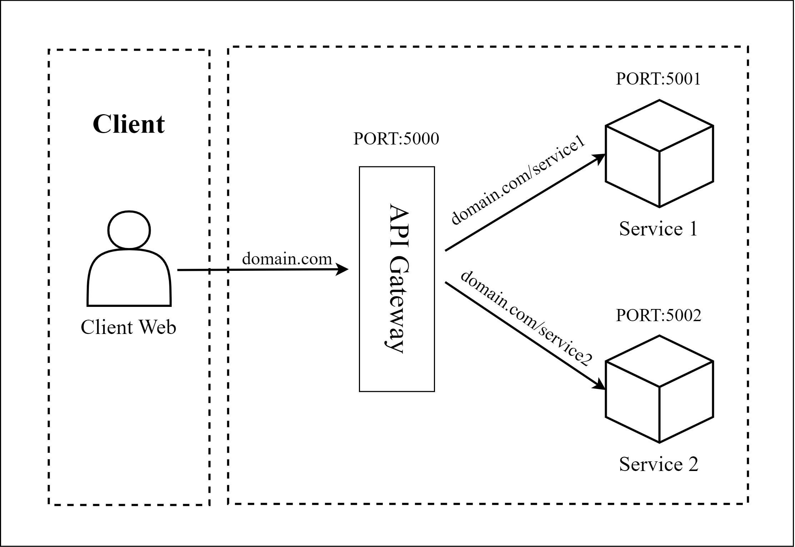
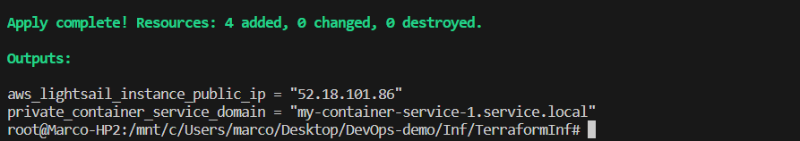
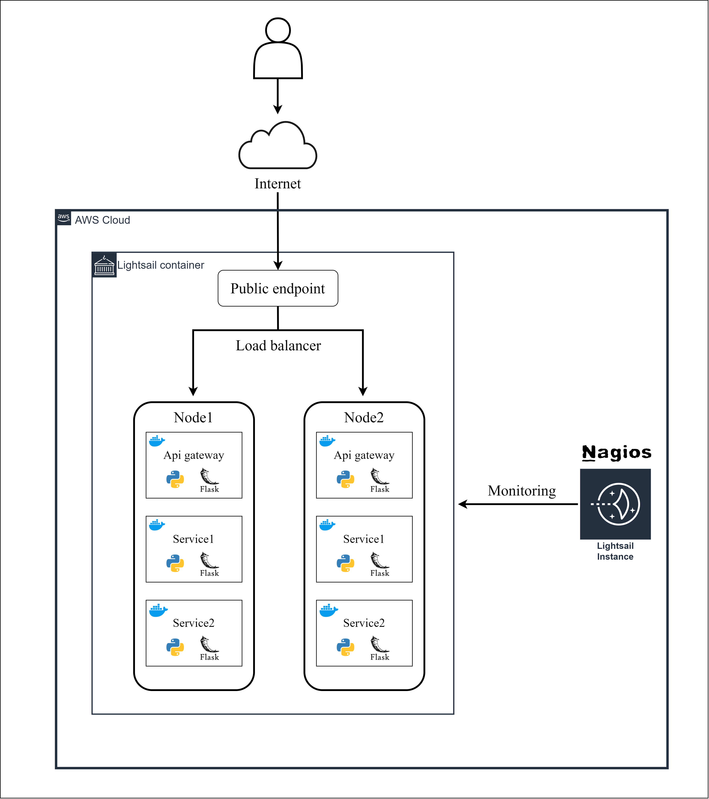
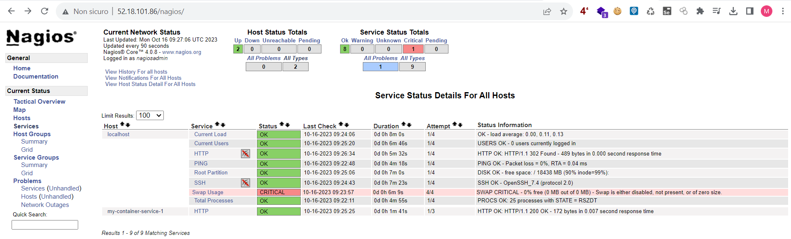
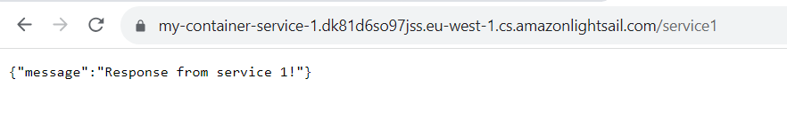
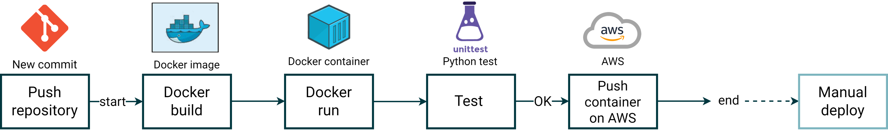

# DevOps-demo

<h2> Introduction </h2>
This project aims to be a minimal demonstration of a DevOps toolchain for a microservices-based application written in Python.
<br>
<br>
Specific tools have been implemented for each DevOps phase:

- Plan: Jira has been implemented for planning with task automations related to repository activities (commit, push, pull...).
- Code: This GitHub repository has been created for the code part.
- Build: Containers are built using Docker.
- Test: Tests have been written using Python's unittest library.
- Release: Continuous integration and deployment have been implemented using GitHub Actions.
- Deploy: The application is deployed on Amazon Lightsail from AWS on the container-based application management service.
- Operate: Infrastructure provisioning is managed using Terraform, while configuration is handled with Ansible.
- Monitor: Nagios server has been installed and configured for monitoring.


 

<h2> Description</h2>
This repository contains 4 folders:

- App: Contains the Docker microservices application written in Flask Python.
- Inf: Contains the Terraform file with AWS Lightsail infrastructure and the Ansible file for Nagios monitoring server configuration.
- Test: Contains unit tests for the 3 Python microservices.
- workflows: Contains the CI/CD pipeline.

<h3> App </h3>
The App folder contains the Flask Python application consisting of 3 containers:

- apygateway: Acts as the entry point for the other two services (APIs), mapped to port 5000, allowing HTTP GET requests to be directed to paths /service1 and /service2.
- service1: Service 1, mapped to port 5001, returns a JSON string.
- service2: Service 2, mapped to port 5002, returns a JSON string.

<h3> Inf </h3>
The Inf folder contains two subfolders:

- TerraformInf
- AnsibleConf
<h4> TerraformInf </h4>
Inside TerraformInf is the Terraform file for provisioning the Amazon Lightsail infrastructure following an IaC approach, consisting of:

- 1 Amazon Linux 2 instance serving as the Nagios monitoring server on the infrastructure.
- 1 static IP address to be linked to the instance.
- 1 service container with two nodes, hosting the Flask Python microservices application.


<h4> AnsibleConf </h4>
The AnsibleConf folder contains the Ansible file for installing and configuring the Nagios monitoring server. <br>
<br>
The configuration includes both default checks on the same instance (localhost) and the addition of the new host (Amazon Lightsail container named my-container-service-1) with an HTTP check on the apigateway service endpoint to verify correct access to all microservices, in other words, it verifies that the apigateway is reachable. <br>
<br>
Additionally, Apache redirect from the site root to the /nagios path has been configured. This allows accessing the Nagios console directly from the instance's public IP address without adding the /nagios path. <br>


```
#Terraform commands

terraform -v
#terraform v1.2.5 on linux_amd64
terraform init
terraform validate
terraform apply

#Ansible commands

#open inventory.ini and set ansible_host (public instance ip) and ansible_ssh_private_key_file (instance ssh key path)
#open vars.yml and set HostName, HostAddress (container private domain) and NagiosPassword

ansible --version
#ansible [core 2.15.1]
ansible-playbook -i inventory.ini nagios_conf.yml
```

<h3> Test </h3>
In Test, there are simple unit tests on the services' endpoints. It only verifies if the response status is 200.
  
    
<h3> workflows </h3>
The workflows folder contains the CI/CD pipeline. When a push is made to the App folder, it builds and runs the container locally, performs tests, and finally pushes the image to the AWS container service. <br>
Deployment is manual directly through the AWS console.

  


  
