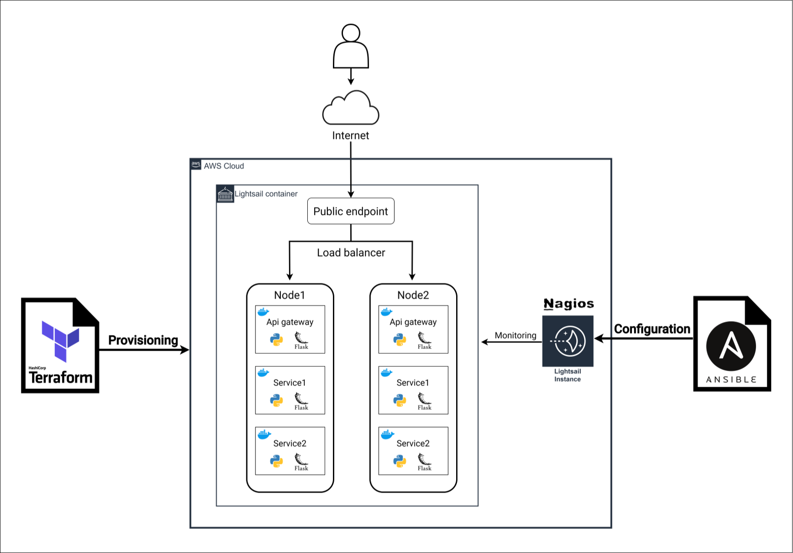
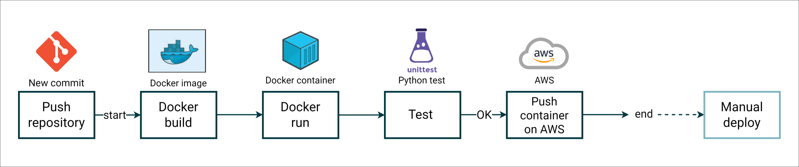

# DevOps-demo

<h2> Introduction </h2>
This project is a simple example of a DevOps toolchain setup for an app with microservices, using Python.
<br>
<br>

Specific tools are used at each stage of DevOps:

- **Planning**: Jira handles planning with automated tasks triggered by repository activities (like commit, push, or pull).
- **Coding**: This GitHub repository is used for code management.
- **Building**: Docker is used to build containers.
- **Testing**: Python's unittest library is used for writing tests.
- **Release**: GitHub Actions handles continuous integration and deployment.
- **Deployment**: The application is deployed to Amazon Lightsail, a container-based service from AWS.
- **Operations**: Terraform manages infrastructure provisioning, and Ansible handles configuration.
- **Monitoring**: Nagios server is installed and configured for system monitoring.


 

<h2> Description</h2>
This repository contains 4 folders:

- **App**: Includes the Docker-based microservices built with Flask in Python.
- **Infrastructure**: Houses the Terraform file for AWS Lightsail setup and the Ansible script for configuring the Nagios monitoring server.
- **Tests**: Contains unit tests for the three Python microservices.
- **Workflows**: Contains the CI/CD pipeline setup.

<h3> App </h3>
The App folder contains the Flask Python application consisting of 3 containers:

- apigateway: Acts as the entry point for the other two services (APIs), mapped to port 5000, allowing HTTP GET requests to be directed to paths /service1 and /service2.
- service1: Service 1, mapped to port 5001, returns a JSON string.
- service2: Service 2, mapped to port 5002, returns a JSON string.

<h3> Inf </h3>
The Inf folder contains two subfolders:

- TerraformInf
- AnsibleConf
<h4> TerraformInf </h4>
The TerraformInf folder contains the Terraform file for provisioning Amazon Lightsail infrastructure with an Infrastructure as Code (IaC) approach. It includes:

- 1 Amazon Linux 2 instance serving as the Nagios monitoring server on the infrastructure.
- 1 static IP address to be linked to the instance.
- 1 service container with two nodes, hosting the Flask Python microservices application.


<h4> AnsibleConf </h4>
The AnsibleConf folder contains the Ansible file for installing and configuring the Nagios monitoring server. <br>
<br>
The configuration has default checks for the local machine (localhost) and a new host, an Amazon Lightsail container called `my-container-service-1`. This setup includes an HTTP check on the apigateway service endpoint to confirm that all microservices can be accessed, meaning it checks if the apigateway is reachable.<br>
<br>
Additionally, Apache redirect from the site root to the /nagios path has been configured. This allows accessing the Nagios console directly from the instance's public IP address without adding the /nagios path. <br>


```
#Terraform commands

terraform -v
#terraform v1.2.5 on linux_amd64
terraform init
terraform validate
terraform apply

#Ansible commands

#open inventory.ini and set ansible_host (public instance ip) and ansible_ssh_private_key_file (instance ssh key path)
#open vars.yml and set HostName, HostAddress (container private domain) and NagiosPassword

ansible --version
#ansible [core 2.15.1]
ansible-playbook -i inventory.ini nagios_conf.yml
```

<h3> Test </h3>
In Test, there are simple unit tests on the services' endpoints. It only verifies if the response status is 200.
  
    
<h3> workflows </h3>
The workflows folder has the CI/CD pipeline. A push to the App folder triggers building and running the container locally, running the tests, and then uploading the image to AWS's container service.

Production deployment is manual and done through the AWS console.

  


  
